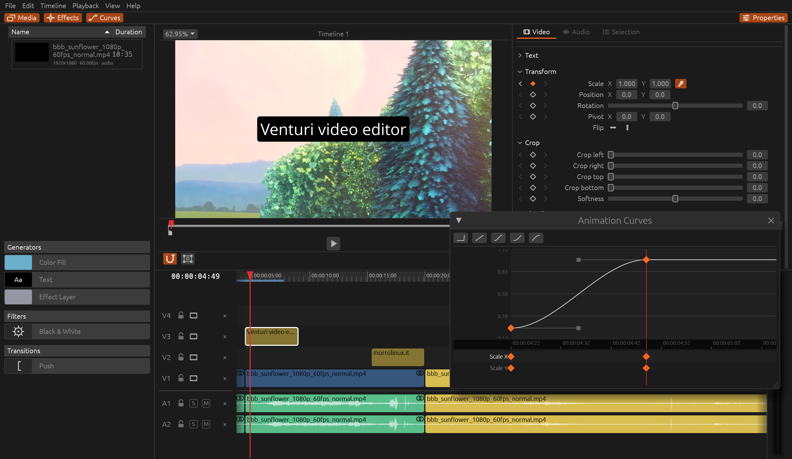

<div align="center">


# Venturi

**A Linux-first, performance-oriented video editor written in Rust.**

A cutting-focused editor, with timelines that travel to and from other NLEs via OpenTimelineIO.

[](https://github.com/morrolinux/VenturiVideo/actions/workflows/ci.yml)
[](https://github.com/morrolinux/VenturiVideo/releases/latest)
[](LICENSE)
[](https://rustup.rs)

[Download](https://github.com/morrolinux/VenturiVideo/releases/latest) •
[Features](#features) •
[Build from source](docs/BUILDING.md) •
[Architecture](ARCHITECTURE.md) •
[Contributing](#contributing)



</div>

---

Venturi does little, and does it well. It is a cutting-only NLE:
multi-track cutting, the transforms and tools you actually reach for while
editing, keyframes on every parameter, transitions, compound clips, ripple
delete. No node editor, no grading suite, no node-based compositor. Cutting
is where the time goes, so that is the part that has to be perfect.

**NOTE: Venturi is alpha software and is considered unstable, especially the save format. Please use at your own risk.**


## Features

- **Fast playback and scrubbing.** Timeline-wide frame cache, optional
  background proxies, playback up to 8x with pitch-preserved audio.
- **Professional timeline workflow.** Track scrubbing with audio, ripple
  delete, compound clips, copy/paste properties, magnet snapping, unlimited
  undo with a jumpable history.
- **Keyframes done right.** Every parameter is keyframable: crop, zoom,
  rotation, position, speed, opacity, audio gain. A dedicated curve editor
  with custom curves.
- **Titles, solid colours, filters, transitions.** Applied straight from the
  timeline, no node graph to wire up.
- **Interoperability.** Timelines move in both directions through
  OpenTimelineIO, tested with DaVinci Resolve: cut here, grade there.
- **Linux first.** Developed and tested on Linux, not ported to it. Also runs
  on Apple Silicon Macs, and possibly Windows.

## Install

Grab the latest build from the
[Releases](https://github.com/morrolinux/VenturiVideo/releases/latest) page:

| Platform | File | Notes |
|---|---|---|
| Linux x86_64 / aarch64 | `Venturi-<arch>.AppImage` | FFmpeg bundled. Needs a Vulkan driver. |
| macOS (Apple Silicon) | `Venturi-arm64.dmg` | Ad-hoc signed, see [first launch on macOS](docs/BUILDING.md#opening-the-app-on-another-mac). |

```sh
chmod +x Venturi-x86_64.AppImage
./Venturi-x86_64.AppImage
```

To build from source, see [docs/BUILDING.md](docs/BUILDING.md).

## The name

The Venturi effect: when a fluid passes through a constriction, it doesn't
slow down, it speeds up. Tight constraints make Venturi faster, so your edits
stay fluid even on modest hardware.

## Contributing

Issues and pull requests are welcome. Before opening a PR:

```sh
cargo fmt
cargo clippy --all-targets -- -D warnings
cargo test --workspace
```

The `CI` workflow runs the same three steps on every pull request. Unit tests
live in `crates/<crate>/src/tests/`, not inline, see
[Where unit tests live](docs/BUILDING.md#where-unit-tests-live). The full
conventions (for humans and coding agents alike) are in [CLAUDE.md](CLAUDE.md)
and [AGENTS.md](AGENTS.md); the design is in [ARCHITECTURE.md](ARCHITECTURE.md).

## Licence

GPL-3.0-or-later, see [LICENSE](LICENSE).

DaVinci Resolve is a trademark of Blackmagic Design Pty Ltd. Venturi is an
independent project, not affiliated with or endorsed by Blackmagic Design.
